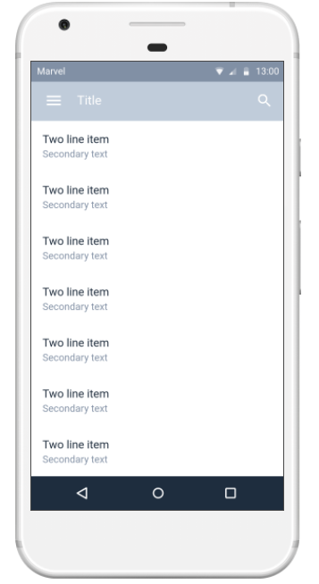
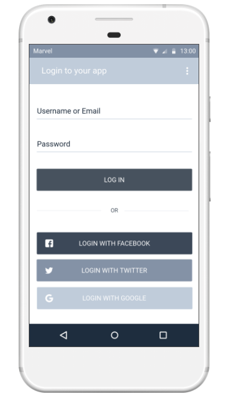

# Documento de Visão do Projeto "Controle de Vacina Digital"

Este documento apresenta uma solução de software para o projeto Controle de Vacina Digital, solicitado pelo cliente Thomas Sassaki, 
apresentando os problemas a serem solucionados, as necessidades dos principais envolvidos, o alcance do projeto e as funcionalidades 
esperadas do sistema.

## Objetivos

-Deixar o usuário sempre informado das suas vacinas.
-Facilitar o acesso do histórico do paciente.
-Fácil localização de postos saúde próximos 
-facil acesso com senhas antecipadas com fluxo de horários

## Problema

- Descrição do problema: Sem controle e disponibilidade de vacinas.
- Quem é afetado pelo problema: todos os usuários sofrem impacto porém pessoas de localidade concentradas sofrem mais.
- Impacto no negócio: perder controle de estoque,disperdícios.
- Benefícios de uma boa solução: uma boa base de dados.

## Definições, abreviações e outros termos do domínio do problema

-jargões hospitalares: http://www.ebserh.gov.br/documents/147715/393018/PrincipaisTermosdeEnfermagem.pdf

## Integração com outros sistemas

- Google maps location
- integração com base de dados dos postos de saúde e os hospitais.

 
## Interessados

-Hospitais
-Postos de saúde
-Empresas
-Academia

## Usuários

- Livre

## Funcionalidades do produto

- Facilidade em consulta e acesso com controle de vacina, disponibilidade e localização.

## Restrições do projeto

- versão ultrapassada Android
- versão ultrapassada IOS
- localidades sem rede

## Protótipo de tela

### Protótipos para funcionalidade 1

### Protótipos para funcionalidade 2

