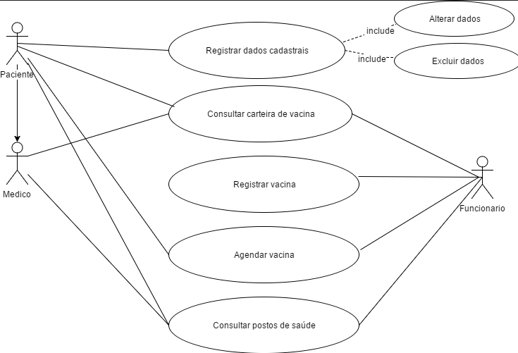

# Casos de uso

## 1. Diagrama de casos de uso

**Instruções do professor**: Insira abaixo o diagrama com os casos de uso do seu sistema. A imagem abaixo é somente um exemplo.

Especificação dos Casos de Uso.

Paciente – Realiza o seu cadastro no sistema controle de vacino. Ele pode altera excluir dados e consultar as vacinas. 

|Identificador|	1.0          |
|---|---|
|Nome	|Paciente|
|Atores	|Paciente|
|Sumário	Paciente – Realiza o seu cadastro no sistema controle de vacino|
|Complexidade|	Alta|
|Regras de Negócio|	O paciente tem como base o controle das suas vacinas.| 
|Pré-condições	|Consultar vacina |
|Pós-condição	|Manter a controle dos pacientes|
|Pontos de Inclusão	|Abrir a sessão do sistema.|
|Pontos de Extensão	|Realizar o fechamento do sistema| 
|Registar dados – realizar o registro dos dados de todos os pacientes|

Identificador	2.0

Nome	Registar dados

Atores	Paciente

Sumário	Tem como controle registra dos os dados dos clientes

Complexidade	Alta

Regras de Negócio	Com os dados registrados dos pacientes, temos como objeto manter os controles dos dados
Pré-condições	Registrar dados

Pós-condição	Excluir e incluir dados cadastrais

Pontos de Inclusão	Abrir a sessão do sistema.

Pontos de Extensão	Realizar o fechamento do sistema 
Consultar carteira de vacina –realiza as consultas das vacinas dos pacientes

Identificador	3.0

Nome	Consultar Carteira de vacina

Atores	Paciente

Sumário	Apresentar todas as vacinas de cada paciente

Complexidade	Alta

Regras de Negócio	Mostrar o controle das vacinas de cada paciente

Pré-condições	Consultar Vacina

Pós-condição	Exibir histórico dos Pacientes. 

Pontos de Inclusão	Consultar a sessão do sistema.

Pontos de Extensão	Realizar o fechamento do sistema 

Registar vacina – realizar o registro das vacinas de todos os pacientes

Identificador	4.0

Nome	Registar vacina

Atores	Funcionário

Sumário	O funcionário realizar o registro das vacinas

Complexidade	Alta

Regras de Negócio	O funcionário realizar os registros das vacinas que os pacientes tomam.

Pré-condições	Registrar vacina

Pós-condição	Exibir os registros das vacinas

Pontos de Inclusão	Abrir a sessão do sistema.

Pontos de Extensão	Realizar o fechamento do sistema 

Agendar vacina –  agendamento de vacina

Identificador	5.0

Nome	Agendar vacina

Atores	Paciente e funcionário

Sumário	Funcionário e paciente podem realizar o agendamento das vacinas

Complexidade	Media

Regras de Negócio	Facilitar e mandar as organizações dos agendamentos das vacinas.

Pré-condições	Agendar vacina

Pós-condição	Organizar e facilitar o agendamento

Pontos de Inclusão	Abrir a sessão do sistema.

Pontos de Extensão	Realizar o fechamento do sistema 

Consultar postos de saúde –  o sistema apresenta dos os postos de saúde. 

Identificador	6.0

Nome	Consultar postos de saúde

Atores	Paciente e funcionário e Médico

Sumário	O sistema apresentar todos os postos de saúde

Complexidade	Media

Regras de Negócio	Apresenta os postos de saúde e suas localidades 

Pré-condições	Localidade dos postos

Pós-condição	Apresenta as localizações dos postos de saúda mais próximos. 

Pontos de Inclusão	Abrir a sessão do sistema.

Pontos de Extensão	Realizar o fechamento do sistema 

Funcionário –  tem acesso para incluir os dados das vacinas 

Identificador	7.0

Nome	Funcionário 

Atores	Funcionário

Sumário	Tem acesso para incluir os dados das vacinas

Complexidade	Media

Regras de Negócio	Após o paciente ter tomado a vacina o funcionário realiza o registro no sistema.  

Pré-condições	Realizar os registros

Pós-condição	Mandar os controles das vacinas. 

Pontos de Inclusão	Abrir a sessão do sistema.

Pontos de Extensão	Realizar o fechamento do sistema 

Medico –  Pode ter acesso as consultas das vacinas dos pacientes e dos postos de saúde. 

Identificador	8.0

Nome	Médico 

Atores	Médico

Sumário	Medico pode ter aceso os dados das vacinas dos pacientes.

Complexidade	Media

Regras de Negócio	Ampliar e facilitar o trabalho do médico. 

Pré-condições	Apresentar dados das vacinas para medico

Pós-condição	Ajudar e facilitar o dia a dia. 

Pontos de Inclusão	Abrir a sessão do sistema.

Pontos de Extensão	Realizar o fechamento do sistema 

**Instruções do professor**: As tabelas acima mostram um exemplo de especificação de **um único caso de uso**. Lembre-se de especificar cada um dos casos de uso.

