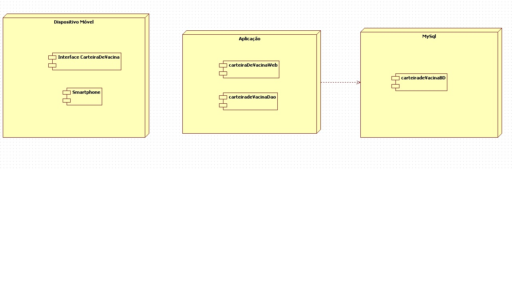

# Arquitetura

## Organização em camadas

Exemplo de organização em camadas, baseado em [Pitfalls using UML in RUP](https://www.sparxsystems.com.au/downloads/whitepapers/Pitfalls%20using%20UML%20in%20RUP%20_part%202_.pdf).

## Implantação

Exemplo de implantação, baseado em [Pitfalls using UML in RUP](https://www.sparxsystems.com.au/downloads/whitepapers/Pitfalls%20using%20UML%20in%20RUP%20_part%202_.pdf).
